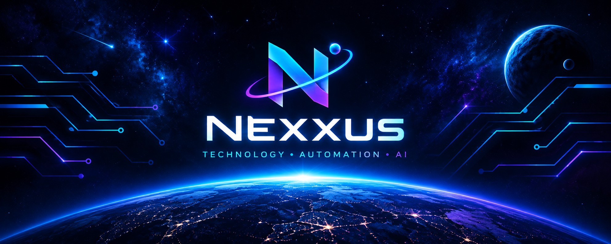

<!-- ═══════════════ NEXXUS · SPACE & NEON ═══════════════ -->

  

  <strong>TECHNOLOGY · AUTOMATION · ARTIFICIAL INTELLIGENCE</strong>

  <em>Die Zukunft entdecken. Schritt für Schritt.</em>

  <code>LEARN</code> &nbsp; <code>BUILD</code> &nbsp; <code>AUTOMATE</code> &nbsp; <code>EXPLORE</code>

---

## 👨‍🚀 Über mich

Willkommen im digitalen Universum von **Nexxus**!

Ich lerne Schritt für Schritt moderne Technologien kennen und baue mein Wissen durch praktische Übungen, Experimente und eigene Projekte aus.

Mich interessieren besonders Automatisierung, Cloud-Native-Technologien, Infrastructure as Code sowie künstliche Intelligenz und Large Language Models.

Mein Ziel ist es, technische Zusammenhänge zu verstehen, praktische Erfahrungen zu sammeln und kontinuierlich bessere Lösungen zu entwickeln.

- 🌱 Ich lerne durch praktische Projekte und Experimente.
- 🧠 Ich beschäftige mich mit Python, Infrastruktur und KI.
- ⚙️ Ich entdecke Automatisierung und moderne Entwicklungswerkzeuge.
- 🚀 Ich dokumentiere meinen Lernfortschritt auf GitHub.
- 🔭 Ich möchte aus Ideen funktionierende Projekte entwickeln.

---

## 🛠️ Technology Universe

### 💻 Programming & Version Control

`Python` `Git` `GitHub`

### 🐳 Containers & Cloud-Native

`Docker` `Kubernetes`

### ⚙️ Infrastructure as Code & Automation

`Ansible` `Terraform`

### 🤖 Artificial Intelligence

`Artificial Intelligence` `LLMs` `AI Automation`

---

## 🧭 Meine Lernmission

| Bereich | Mein Fokus |
| --- | --- |
| 🐍 Python | Programmierung und Skripting |
| 🔀 Git & GitHub | Versionskontrolle und Projektverwaltung |
| 🐳 Docker | Container erstellen und verwalten |
| ☸️ Kubernetes | Container-Orchestrierung verstehen |
| ⚙️ Ansible | Konfiguration und Automatisierung |
| 🏗️ Terraform | Infrastruktur als Code beschreiben |
| 🤖 AI & LLMs | KI-Anwendungen und Sprachmodelle kennenlernen |

---

## 🧪 Mission Log – Meine Lernprojekte

Hier dokumentiere ich Übungen, Experimente und Projekte, mit denen ich neue Technologien praktisch kennenlerne.

### 🐍 Python Lab

Kleine Skripte und Programme, um Programmiergrundlagen zu lernen und wiederkehrende Aufgaben zu automatisieren.

**Projektideen:** Datei-Organizer, Systeminformationen auslesen, kleine CLI-Tools.

### 🐳 Container Lab

Erste Anwendungen mit Docker verpacken und deren Ausführung nachvollziehen.

**Projektideen:** Eine einfache Python-Anwendung containerisieren und mit einer eigenen Docker-Konfiguration starten.

### ☸️ Cloud-Native Lab

Die Grundlagen von Kubernetes und dem Betrieb containerisierter Anwendungen erkunden.

**Projektideen:** Eine kleine Anwendung lokal bereitstellen und Deployments sowie Services kennenlernen.

### 🏗️ Infrastructure Lab

Mit Ansible und Terraform experimentieren, um Konfigurationen und Infrastruktur reproduzierbar zu beschreiben.

**Projektideen:** Eine Testumgebung automatisiert konfigurieren und Infrastruktur-Code versionieren.

### 🤖 AI & LLM Lab

Die Möglichkeiten großer Sprachmodelle entdecken und kleine KI-Experimente durchführen.

**Projektideen:** Ein einfacher Dokumentationsassistent, ein Prompt-Experiment oder ein kleines Python-Projekt mit einem LLM.

> Die Labs sind mein Lernplan. Ich ergänze Links, Ergebnisse und Dokumentationen, sobald die jeweiligen Projekte veröffentlicht sind.

---

## 📊 GitHub Telemetry

  

  

*Die Statistik-Karten werden von einem externen Dienst erzeugt. Sie zeigen verfügbare GitHub-Daten und können verzögert laden oder vorübergehend nicht erreichbar sein.*

---

## 🎯 Next Objectives

- [ ] Python-Grundlagen festigen
- [ ] Git und GitHub sicher anwenden
- [ ] Erste eigene Python-Tools veröffentlichen
- [ ] Eigene Docker-Images erstellen
- [ ] Kubernetes-Grundlagen praktisch ausprobieren
- [ ] Ansible-Playbooks entwickeln
- [ ] Erste Terraform-Konfigurationen erstellen
- [ ] Ein kleines KI- oder LLM-Projekt umsetzen
- [ ] Projekte mit verständlichen READMEs dokumentieren

---

## 🪐 Meine Prinzipien

> Jede neue Technologie ist eine Gelegenheit, etwas zu lernen.
> Jeder Fehler ist eine Chance, Zusammenhänge besser zu verstehen.
> Jeder kleine Schritt bringt mich meinem Ziel näher.

- **Explore:** neugierig bleiben und neue Ansätze testen.
- **Build:** Wissen in praktische Projekte umsetzen.
- **Automate:** wiederkehrende Aufgaben vereinfachen.
- **Improve:** aus Fehlern lernen und Lösungen verbessern.

---

## 📡 Connect

  

  🌌 Exploring technology. Building skills. Shaping the future.

<!-- ═══════════════════ END OF NEXXUS ═══════════════════ -->
